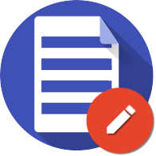

 

Omni-Notes
==========

[](https://www.gnu.org/licenses/gpl-3.0)
[](https://github.com/federicoiosue/Omni-Notes/actions?query=workflow%3ACI)
[](https://github.com/federicoiosue/Omni-Notes/actions?query=workflow%3ACodeQL)
[](https://sonarcloud.io/dashboard?id=omni-notes)
[](https://sonarcloud.io/dashboard?id=omni-notes)
[](https://crowdin.com/project/omni-notes)
[](https://github.com/federicoiosue/Omni-Notes/releases/latest)

Omni-Notes is a note taking <b>open-source</b> application aimed to have both a <b>simple interface</b> while keeping <b>smart</b> behavior. This application expands on the generic note taking features of other basic applications and allows for users to attach image and video files, use a variety of widgets, tag and organize notes, search through notes, and customize the applications UI.

The project was inspired by the absence of such applications compatible with old phones and old versions of Android. It aims to provide an attractive look and follow the most recent design guidelines of the Google operating system that is not currently avaialbe for older devices.

**Follow the developments and post your comments and advice on Facebook Community at https://www.facebook.com/OmniNotes**

Help to keep translations updated is always welcome, if you want give a hand checkout the translation project on *https://translate.omninotes.app.*

<a href="https://f-droid.org/repository/browse/?fdid=it.feio.android.omninotes.foss" target="_blank">
</a>
<a href="https://play.google.com/store/apps/details?id=it.feio.android.omninotes" target="_blank">
</a>

If you're willing to help speeding up developments please also opt-in for the Alpha version of the app following continuous delivery principles:

<a href="https://play.google.com/store/apps/details?id=it.feio.android.omninotes.alpha" target="_blank">
</a>

## Features

Currently the following functions are implemented:

* <b>Material Design interface:</b> Basic add, modify, archive, trash and delete notes actions
* <b> Advanced Navigation and Sharing: </b>Share, merge and search notes, Export/import notes to backup
* <b> Media Attachments: </b> Image, audio and generic file attachments
* <b>Organization: </b>Manage your notes using tags and categories
* <b>Specialty Features:</b>To-do list, Sketch-note mode, Google Now integration: just tell "write a note" followed by the content
* <b> Widget Capabilities: </b>Multiple widgets, DashClock extension, Android 4.2 lockscreen compatibility, Notes shortcut on home screen
* <b> Internationalization: </b>Multilanguage: 30+ languages supported: https://crowdin.com/project/omni-notes


Future Developments:

* Notes sychronization
* Web interface to manage notes ([stub project](https://github.com/federicoiosue/omni-notes-desktop))

You can find a complete changelog inside the application settings menu!

If you need some help on how to use the application you'll find everything you need in the [Help Online](assets/help/help.md) section.

[](https://youtu.be/0Z_-SgT3qYs "Promo video")


## User guide

Look into the wiki for GIFs-based tutorials: [LINK](https://github.com/federicoiosue/Omni-Notes/wiki)

## Build

Watch the following terminal session recording on how to compile distributable files or follow the instructions below
[](https://asciinema.org/a/102898)

Build instructions:
* Enter your computer's terminal
* Clone the application by using the link to the repository (https://github.com/federicoiosue/Omni-Notes), this will take a couple minutes
* Enter the Omni-Notes folder using the command $cd Omni-Notes
* Check that the branch is up to date by using the command $git status
* Enter the command $export ANDROID_HOME=/home/fede/Android/Sdk
* Enter the command $./gradlew assemble
* Allow a couple minutes for the application to build.
* View the outputs of the build using the command $ls -l omniNotes/build/outputs/apk


To be sure that build environment is fully compliant with the project the following command creates a container with all the needed tools to compile the code:

```
cd {project-folder}; rm local.properties; docker rm android-omninotes; docker run -v $PWD:/workspace --name android-omninotes tabrindle/min-alpine-android-sdk:latest bash -c "mkdir -p ~/.android && touch ~/.android/repositories.cfg && yes | sdkmanager --update &>/dev/null && cd /workspace && ./gradlew clean build --stacktrace -Dorg.gradle.daemon=true -Pandroid.useDeprecatedNdk=true"

```

## Test

To execute all tests included into the project connect a device or emulator, then run the following command:

```shell
./gradlew testAll
```

### Testing Pyramid

To speedup the development more levels of testing are available following the [testing pyramid approach](https://martinfowler.com/articles/practical-test-pyramid.html), each type test requires more time than the previous one.

### Unit Tests
```shell
./gradlew --stacktrace test
```

### Integration Tests
```shell
./gradlew --stacktrace -Pandroid.testInstrumentationRunnerArguments.notAnnotation=androidx.test.filters.LargeTest connectedAndroidTest
```

### UI Tests
```shell
./gradlew --stacktrace -Pandroid.testInstrumentationRunnerArguments.annotation=androidx.test.filters.LargeTest connectedPlayDebugAndroidTest
```
Notice that in this case I specified a single flavor to run tests on. This could be a useful and faster approach when you're testing specific flavor features.  

## Mentioned on

[XDA](https://www.xda-developers.com/omni-notes-the-open-source-note-app/)
[Android Authority](https://www.androidauthority.com/best-note-taking-apps-for-android-205356/)
[Droid Advisor](https://droidadvisor.com/omni-notes-note-taking-app/)
[Addictive Tips](https://www.addictivetips.com/android/note-taking-apps-for-android/)
[Techalook](https://techalook.com/apps/best-sticky-notes-android-iphone/)
[DZone](https://dzone.com/articles/amazing-open-source-android-apps-written-in-java)
[Slash Gear](https://www.slashgear.com/best-note-taking-apps-for-android-phones-and-tablets-04529297/)
[quaap.com](https://quaap.com/D/use-fdroid)
[Best productivity apps](https://freeappsforme.com/productivity-apps-android-ios-2017/#omni-notes) by freeappsforme.com

## Developed with love and passion by

* Federico Iosue - [Website](https://federico.iosue.it)
* [Other contributors](https://github.com/federicoiosue/Omni-Notes/graphs/contributors)

## License


    Copyright 2013-2022 Federico Iosue
    
    This program is free software: you can redistribute it and/or modify
    it under the terms of the GNU General Public License as published by
    the Free Software Foundation, either version 3 of the License, or
    (at your option) any later version.
    
    This program is distributed in the hope that it will be useful,
    but WITHOUT ANY WARRANTY; without even the implied warranty of
    MERCHANTABILITY or FITNESS FOR A PARTICULAR PURPOSE.  See the
    GNU General Public License for more details.
    
    You should have received a copy of the GNU General Public License
    along with this program.  If not, see <http://www.gnu.org/licenses/>.

